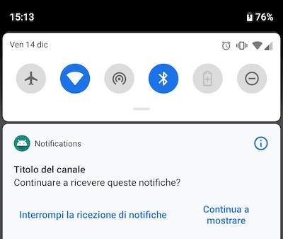

# Notifiche per Android

Requisiti
- Android Studio
- Leggere la [documentazione](https://firebase.google.com/docs/cloud-messaging/?authuser=0)
- un account Firebase ( Google )
- Postman ( per i test )
- Leggere la [documentazione](https://firebase.google.com/docs/cloud-messaging/?authuser=0)

Questa non vuole essere una guida, è solo un mock di una applicazione con due appunti
personali per ricordarmi le cose salienti.

### 1. Preparazione

In Android Studio, sotto il menù `Tools` scegliere `Firebase`


Una a volta aperto il tab `Assistant`, seguire le istruzioni,
ovvero collegare l'applicazione a Firebase, il che creerà il file
`google-services.json` nel modulo `app` e in seguito aggiunge le
oppportune librerie a `build.gradle`

```
apply plugin: 'com.google.gms.google-services'

dependencies {
    ...
    implementation 'com.google.firebase:firebase-messaging:17.3.4'
}
```


### 2. Implementazione Client

Una implementazione base, si riduce ad estendere la classe `FirebaseMessagingService` più o meno come
la classe di questo progetto, ed inserire tale classe nel manifest file come servizio. Per il dettaglio dei metodi
e del funzionamento, fare riferimento alla [documentazione](https://firebase.google.com/docs/cloud-messaging/android/client?authuser=0) di Firebase.
In particolare, prestare attenzione al metodo `onMessageReceived`, di cui segue una implementazione che sarà più chiara dopo
aver letto l'implementazione lato server.

```java
override fun onMessageReceived(remoteMessage: RemoteMessage) {
    sendNotification(
        title = remoteMessage.data.getValue("title"),
        body  = remoteMessage.data.getValue("message")
    )
}
```

```html
<!-- manifest file -->
<service android:name=".AppNotificationService" android:exported="false">
    <intent-filter>
        <action android:name="com.google.firebase.MESSAGING_EVENT" />
    </intent-filter>
</service>
```

### 3. Testing

A questo punto l'applicazione è in grado di ricevere notifiche, meglio testarla un device fisico piuttosto che sull'emulatore
per evitare problemi di connessione. Occorre recuperare quindi un paio di chiavi prima di tutto: la prima, è la chiave server
dell'applicazione da Firebase che si trova nelle `impostazioni progetto` nel tab `cloud messaging`


La seconda chiave che occorre per questo test, è il `token` generato dalla applicazione, che identifica il terminale, recuperabile
nei log con Logcat grazie al metodo `onNewToken`. Questo è il token che va associato all'utente, al terminale e salvato in qualche
modo su un server per poter essere recuperato prima dell'invio di notifiche.

```java
override fun onNewToken(token: String) {
    Log.d("token", token)
}
```

Per inviare la notifica, occorre un programma per l'esecuzione di richieste REST: `curl` va benissimo, `Postman` pure.
I parametri da utilizzare sono i seguenti:
-  inviare una richiesta POST alla URL https://fcm.googleapis.com/fcm/send
- inserire gli headers
   ```
   Content-type:application/json
   Authorization:key=<Chiave Server>
   ```
- inserire nel body
    ```
    {
      "data": {
        "title": "Titolo della notifica",
        "message": "Questo è un messaggio inviato da remoto attraverso una notifica"
      },
      "to": "<token ricavato dal log>"
    }
    ```

..che tradotto con un comando curl assomiglia a qualcosa del genere

```bash
curl -X POST --header "Authorization: key=<SERVER KEY>" \
    --Header "Content-Type: application/json" \
    https://fcm.googleapis.com/fcm/send \
    -d "{\"to\":\"<FCM TOKEN>\",\"notification\":{\"body\":\"ENTER YOUR MESSAGE HERE\"}"
```

Due parole sul json passato come body, in riferimento anche a quanto scritto in precedenza riguardo il metodo `onMessageReceived` che riporto
qui per una più facile lettura

```java
override fun onMessageReceived(remoteMessage: RemoteMessage) {
    sendNotification(
        title = remoteMessage.data.getValue("title"),
        body  = remoteMessage.data.getValue("message")
    )
}
```

Come è semplice intuire, **nell'attributo `data` posso passare quanti dati desidero, di qualunque tipo, verso l'applicazione** per poi
recuperarli come nell'esempio qui sopra

I valori impostati appaiono nella notifica poiché ne ho impostato l'utilizzo in tal modo nel metodo `sendNotification`


Il Channel invece, appare solo per versioni pari o successive ad Android O



### 4. Implementazione Server

A questo punto basta far eseguire la richiesta REST descritta in precedenza ad uno script o una web application,
l'unico requisito è che il web server abbia accesso ad internet, o comunque possa raggiungere il dominio `googleapis.com`